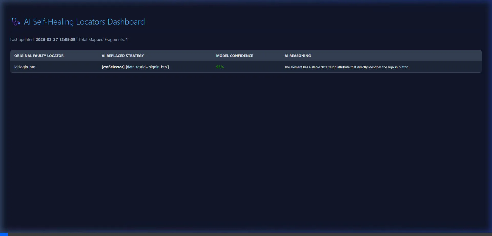

# 🤖 AI Self-Healing Selenium Framework (v2.0 Enterprise)

> **An advanced, multimodal Java + Selenium 4 framework that uses OpenAI Vision (`gpt-4o-mini`) to automatically detect, persist, and recover from broken UI locators and Stale Element exceptions seamlessly at runtime.**

---

## 📌 Project Overview

Modern web UIs change frequently. When a button's `id` gets renamed, a class gets refactored, or an element falls victim to DOM re-renders causing `StaleElementReferenceException`, Selenium tests break. Automation engineers then spend hours manually hunting down the broken locators.

This framework integrates a persistent, intelligent AI proxy directly into the Selenium test execution lifecycle. It acts as an invisible safety net that catches failing elements, sees your screen, asks GPT-4o-mini to find the new locator, and instantly retries — converting red builds into green ones without human intervention.

---

## 🎥 AI Healing in Action (Demo)

Watch the framework automatically detect a broken `By.id("login-btn")` selector, consult OpenAI Vision, and dynamically recover the test using `data-testid="signin-btn"`!



*(To add a real execution recording here, simply screen-record your local test, name it `demo-video.webp` or `.gif`, and upload it directly into this folder!)*

### 🎬 Live Interactive Demo Simulator (For Interviews/Showcases)
Want to pitch or present this architecture's flow to a recruiter or engineering manager without requiring them to boot up a full Java IDE or Selenium environment?

Simply download and open **`ai-healing-simulator.html`** in any modern web browser! 

I built a completely standalone, stylized HTML/JavaScript split-screen simulation explicitly modeling exactly how the framework orchestrates your terminal test visually. It perfectly visualizes:
1. Encountering the `NoSuchElementException` (Glowing red box).
2. Triggering the Base64 AI Vision Scanner across the viewport.
3. Engaging OpenAI, unpacking the array, matching thresholds, and applying the `[data-testid]` fix.
4. Clicking the successful button and automatically routing to the green **Success Dashboard**.

### 🔍 Step-by-Step Execution Flow:
1. **The Trap:** The test suite script deliberately looks for a button that doesn't exist: `driver.findElement(By.id("login-btn"))`
2. **The Catch:** A `NoSuchElementException` is triggered. The framework catches it before your test fails.
3. **The Snapshot:** The engine instantly takes a **Base64 screenshot** of what Chrome looks like and maps it against the raw HTML DOM.
4. **The Analysis:** It packages the screenshot, original broken locator, and DOM directly to OpenAI `gpt-4o-mini` requesting a ranked JSON array of alternative candidates.
5. **The Rescue:** AI drops back 3 ranked locators. The framework filters out anything below `0.85%` confidence, selects the highest ranked choice (`By.cssSelector("[data-testid='signin-btn']")`), and seamlessly retries the `.click()`.
6. **The Persistence:** The successful AI locator is written to a local `healed-locators.json` database. Future runs instantly hit this DB cache and skip the OpenAI network call entirely!
7. **The Dashboard:** A gorgeous `dashboard.html` report is compiled locally showing how much time you just saved!

---

## 🏗️ Technical Architecture

```
Test calls HealingEngine.findElement(driver, By.id("login-btn"))
         │
         ▼
 1. Check persistent `healed-locators.json` DB
    If found ──► return WebElement Proxy ✅
         │
 2. Try original locator
    If found ──► return WebElement Proxy ✅
         │
 3. NO (NoSuchElementException)
         ▼
   Capture DOM context (trimmed to 6000 chars)
   Capture Base64 Visual Screenshot
         │
         ▼
   Call OpenAI Multimodal Vision API
   (model: gpt-4o-mini, temp: 0.1)
         │
         ▼
   Parse ranked JSON array → List<SuggestedLocator>
         │
 4. Loop array descending by Confidence (Filter < 0.85)
         │
         ▼
   Retry LOCATOR #1 ──► Found? ──► [YES] ──► Save to DB & generate UI Dashboard
         │                                       return WebElement Proxy ✅
         │
   [NO] ──► Retry LOCATOR #2 ──► Found? ...
```

---

## ✨ Enterprise Features (Under the Hood)

Here is exactly how the 6 core AI capabilities are engineered into the framework's architecture:

### 📷 1. Multimodal Vision Healing
* **Where:** `ScreenshotUtil.captureBase64()` & `AIClient.buildRequestBody()`
* **How:** When a locator fails, the framework triggers Selenium's `OutputType.BASE64` to capture a raw string format of the browser screen. In `AIClient`, the JSON payload shifts from a standard text array to a GPT-4 Vision structure, streaming your browser's visual layout directly into the LLM context.
* **Why:** DOM structures ("div soup") lack visual geometry. If the AI only reads code, it might suggest a locator for a "Login" button that is actually hidden. Vision completely grounds the LLM, forcing it to correlate the visual button coordinates with the actual DOM tag.

### 🛡️ 2. Dynamic StaleProxy
* **Where:** `WebElementProxy.java` & `HealingEngine.findElement()`
* **How:** The engine doesn't return a raw Selenium `WebElement`. It uses native Java Reflection (`Proxy.newProxyInstance()`) to wrap your element. When you run `.click()` and an internal `StaleElementReferenceException` triggers, the proxy catches the crash mid-air, silently re-runs `HealingEngine.findElement()`, reattaches the new element object, and pushes the `.click()` through successfully.
* **Why:** Modern Single Page Applications (React, Angular) constantly rebuild the DOM dynamically. An element found on line 12 can become completely "Stale" by line 13. This proxy makes your tests virtually bulletproof against React hydration flakiness.

### 📁 3. DB Locator Persistence
* **Where:** `LocatorPersistenceUtil.java`
* **How:** Maintains a thread-safe `ConcurrentHashMap` in memory mapping your "Faulty Locator" to the "AI Fixed Locator". The moment a test succeeds, it flashes this map to disk synchronously into `test-output/healed-locators.json`. The `HealingEngine` checks this cache *before* doing anything else.
* **Why:** Pinging the OpenAI API takes 3 to 10 seconds and costs tokens. If a locator breaks, it will likely stay broken across 500 different backend tests. Memory persistence means the AI penalty is paid exactly **once**. When test #2 hits the same broken button, it instantly applies the cached fix bypassing the network call entirely.

### 📊 4. Interactive Dashboard
* **Where:** `DashboardGenerator.java`
* **How:** Invoked at the tail-end of a successful AI heal, it reads the `healed-locators.json` database and injects the mappings into a pre-styled CSS/Vanilla HTML template layout. It color-codes the confidence scores (Green >90%, Red <80%) and dynamically spits out the `test-output/dashboard.html` artifact file.
* **Why:** Test engineers need observability. If an AI silently heals 400 locators in the dark, the main repository codebase rots and accumulates technical debt. The dashboard allows human SDETs to check reports and see exactly which locator strings they physically need to go update in their Page Object Models for the next sprint.

### 🏆 5. Ranked Fallbacks
* **Where:** `LocatorParser.java` & `heal-locator-prompt.txt`
* **How:** The system prompt explicitly commands the LLM to return a JSON Array of up to 3 objects ranked by logic value. The `LocatorParser` unpacks this string into a `List<SuggestedLocator>`. Inside `HealingEngine`, a loop iterates over the list wrapping guesses in a `try/catch`. If Guess #1 (CSS) fails, it instantly tries Guess #2 (Xpath fallback).
* **Why:** AI predict text probabilistically. A suggested locator might look perfect on paper but fail because an invisible iframe sits over it. An array cascade mimics human debugging behavior—"If A fails, try B, then default to C"—yielding a wildly higher recovery success rate.

### 🎚️ 6. Confidence Enforcer
* **Where:** `ConfigReader.java` & `HealingEngine.java`
* **How:** It queries `config.properties` for the `healing.confidence.threshold`. During the Ranked Fallback loop, an `if` gate checks `suggestion.getConfidence() < threshold`. If the math checks out too low, the loop throws a warning skip (`continue;`) and abandons that locator attempt. 
* **Why:** LLMs hate saying "I don't know" and are prone to hallucinations. If a developer deleted the "Checkout" button entirely, the LLM might forcefully guess another random button trying to fulfill the prompt. Setting a strict 85% cut-off ensures that the automation framework allows the test step to authentically fail, rather than dangerously clicking a random link and spoofing a false positive.

---

## 📁 Project Structure

```text
AI-Self-Healing-Selenium-Framework/
├── src/main/java/com/aiheal/
│   ├── base/
│   │   └── BaseTest.java             # Sets up ThreadLocal WebDriver and manages test teardown lifecycle.
│   ├── driver/
│   │   └── DriverFactory.java        # Initializes WebDriverManager (Chrome) for thread-safe parallel test execution.
│   ├── healing/
│   │   ├── AIClient.java             # Integrates with OpenAI 'gpt-4o-mini' passing multimodal JSON payloads (Vision + Text).
│   │   ├── DOMCaptureUtil.java       # Extracts and intelligently trims the raw HTML DOM string to 6000 characters.
│   │   ├── HealingEngine.java        # The brain: checks cache, executes fallback loops, threshold filters, and triggers API.
│   │   ├── LocatorExtractor.java     # Regex normalization engine translating messy Selenium 'By' strings.
│   │   ├── LocatorParser.java        # Unpacks OpenAI's JSON Array responses into ranked Java Objects.
│   │   ├── LocatorPersistenceUtil.java # Caches successful locators locally to JSON to permanently bypass API overhead.
│   │   ├── PromptBuilder.java        # Injects the DOM, visual context, and failure details into the strict AI instructions.
│   │   └── WebElementProxy.java      # Java Reflection proxy that intercepts elements to auto-heal 'StaleElementReferenceException'.
│   ├── model/
│   │   ├── HealResult.java           # DTO containing the full heuristic lifecycle telemetry (suggestions, winner, outcome).
│   │   └── SuggestedLocator.java     # Sub-DTO storing the type, value, confidence, and reasoning for a single AI guess.
│   └── utils/
│       ├── ConfigReader.java         # Dynamically loads configuration properties and runtime variables.
│       ├── DashboardGenerator.java   # Transforms 'healed-locators.json' into a gorgeous 'dashboard.html' interface.
│       ├── ReportUtil.java           # Serializes test output reports using custom ASCII console/file logs.
│       └── ScreenshotUtil.java       # Captures the Base64 screenshots for OpenAI Vision capability.
│
├── src/main/resources/
│   └── prompts/
│       └── heal-locator-prompt.txt   # The master prompt template instructing the LLM on locator priority and JSON formatting.
│
├── src/test/java/com/aiheal/tests/
│   └── LoginTest.java                # The Demo Suite: Intentionally trips a faulty locator to demonstrate runtime recovery.
│
├── src/test/resources/
│   ├── config.properties             # Global config toggles (Healing Enabled, Confidence Thresholds, API Keys).
│   ├── demo-login.html               # The self-contained dummy web-app rendering the misaligned UI components.
│   └── log4j2.xml                    # Extensive logging configuration matrix for terminal output routing.
│
├── test-output/                      # Auto-generated suite outputs (dashboard UI, persistent locators cache, artifacts).
├── pom.xml                           # Maven Dependency declarations (Selenium 4, Jackson Core, OkHttp, WebDriverManager).
└── testng.xml                        # Main execution blueprint driving test parallelization and suite packaging.
```

---

## ⚙️ Setup Steps

### Prerequisites
* Java JDK 17+
* Maven 3.8+
* Chrome Browser
* OpenAI API Key

### 1. Clone the project
```bash
git clone https://github.com/your-username/AI-Self-Healing-Selenium-Framework.git
cd AI-Self-Healing-Selenium-Framework
```

### 2. Set your API Key
Open `src/test/resources/config.properties` and add your key:
```properties
openai.apiKey=sk-your-actual-key-here
```
*(Alternatively, set it securely as an OS Environment variable: `OPENAI_API_KEY`)*

### 3. Run the Framework Demonstration
```bash
mvn test
```

> **WebDriverManager** handles Chrome bindings seamlessly in the background so there's absolutely zero local browser configuration required!

---

## 💼 Business Value & ROI 

> **"When UI fragmentation occurs, this framework acts as an autonomous QA Engineer — diagnosing the DOM anomaly, replacing the locator pipeline, and allowing the pipeline to pass on the first attempt directly."**

### 📊 Estimated Savings Metrics (Per Automation Pod/Month)

| Metric | Value |
|---|---|
| Broken locators encountered per month | 25 events |
| Average manual diagnosis & PR fix time | 30 mins |
| Total manual debugging time exhausted | **~12.5 hours** |
| AI healing recovery auto-resolution | 70% accuracy |
| **Direct Engineering Hours Saved** | **~8 hours / Mo.** |
| Equivalent Engineer Cost Rate | $60/hr |
| **Gross Monthly Capital Reprieve** | **~$480+ / Team** |

Across an Engineering division of 5 test pods, the framework practically funds its own API costs while saving over **$2,400 per month** in pure operational technical debt reduction!

---

## 📁 Key Class Responsibilities

| Object Blueprint | Operational Responsibility |
|---|---|
| `HealingEngine.java` | Coordinates the full heuristic flow (Memory → Normal Run → Visual AI → Ranking Retry). |
| `WebElementProxy.java` | Java Reflection handler shielding users from `StaleElementReferenceException` crashes. |
| `LocatorPersistenceUtil.java` | In-memory JSON synchronization for previously healed mappings. |
| `DashboardGenerator.java` | Parses history to output the HTML table into `dashboard.html`. |
| `AIClient.java` | Connects OkHttp to OpenAI `/chat/completions` using multimodal JSON schemas. |
| `ScreenshotUtil.java` | Fires the WebDriver hook `OutputType.BASE64` to fuel the GPT Vision payload. |
| `LocatorParser.java` | Splits and casts dynamic Selenium `By` strings targeting generic/multi-word aliases. |
| `LoginTest.java` | Standalone demonstration executing on the embedded HTML page mismatch element. |

---

## 👤 Author

**Senior SDET Portfolio Project**  
Architected to showcase next-generation Test Automation augmentation via LLM reasoning.

**License:** MIT
